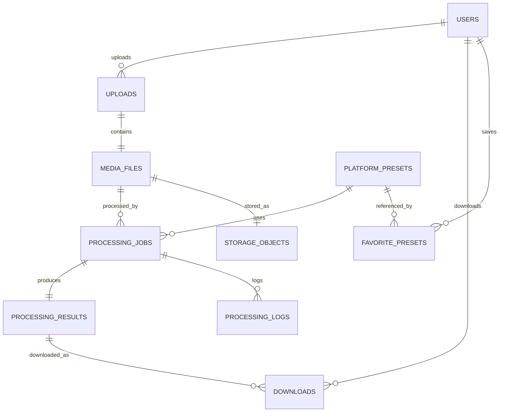

# Entity Relationship Diagram (ERD)

# Forkekan-mint

> Anti Video Burik.
>
> "4K kan min!"

Version: 2.0

---

# Overview

Dokumen ini menjelaskan struktur database Forkekan-mint.

Desain database dibuat menggunakan prinsip:

- Single Responsibility
- Scalable
- Normalize
- Future Ready
- Enterprise Friendly

Database:
PostgreSQL

---

# Database Diagram

---

# Entity List

1. users
2. uploads
3. media_files
4. storage_objects
5. platform_presets
6. processing_jobs
7. processing_results
8. processing_logs
9. downloads
10. favorite_presets

---

# users

Menyimpan akun pengguna.

Fields

- id
- name
- email
- avatar_url
- provider
- provider_id
- role
- created_at
- updated_at

Role

- USER
- ADMIN

---

# uploads

Representasi aktivitas upload.

Satu upload dapat menghasilkan satu media.

Fields

- id
- user_id (nullable)
- upload_status
- uploaded_at
- ip_address
- user_agent

Status

- uploading
- uploaded
- failed

---

# media_files

Menyimpan metadata video.

Fields

- id
- upload_id
- original_filename
- stored_filename
- mime_type
- file_size
- duration
- width
- height
- fps
- bitrate
- codec
- audio_codec
- audio_bitrate
- thumbnail_path
- created_at

Media file hanya menyimpan metadata.

Tidak menyimpan lokasi storage.

---

# storage_objects

Lokasi file fisik.

Fields

- id
- media_file_id
- disk
- bucket
- object_key
- checksum
- visibility
- expires_at

Contoh

disk

- local
- cloudflare-r2

visibility

- public
- private

---

# platform_presets

Preset optimasi.

Fields

- id
- name
- slug
- description
- target_resolution
- target_codec
- target_fps
- target_bitrate
- target_audio_codec
- target_audio_bitrate

Contoh

- WhatsApp Story
- Instagram Story
- Instagram Reels
- TikTok
- Telegram
- Discord
- YouTube Shorts

---

# processing_jobs

Semua pekerjaan encoding.

Fields

- id
- media_file_id
- preset_id
- queue_name
- worker_name
- status
- progress
- started_at
- finished_at
- failed_reason

Status

- waiting
- processing
- completed
- failed

---

# processing_results

Hasil akhir encoding.

Satu media dapat memiliki banyak hasil.

Contoh

Original

↓

WhatsApp Result

↓

Instagram Result

↓

TikTok Result

Fields

- id
- processing_job_id
- output_filename
- output_size
- output_resolution
- output_codec
- output_bitrate
- processing_time
- preview_thumbnail

---

# processing_logs

Semua aktivitas worker.

Fields

- id
- processing_job_id
- level
- message
- created_at

Level

- info
- warning
- error

---

# downloads

Riwayat download.

Fields

- id
- user_id
- processing_result_id
- downloaded_at

---

# favorite_presets

Preset favorit user.

Fields

- id
- user_id
- preset_id
- created_at

---

# Relationship

User

↓

Uploads

↓

Media File

↓

Storage Object

↓

Processing Job

↓

Processing Result

↓

Download

Preset

↓

Processing Job

↓

Favorite Preset

---

# Index Recommendation

users

- email

uploads

- user_id

media_files

- upload_id

processing_jobs

- media_file_id
- status

processing_results

- processing_job_id

downloads

- user_id

favorite_presets

- user_id

---

# Retention Policy

Guest

- Upload disimpan maksimal 24 jam.

Registered User

- Upload tersimpan pada History.
- File hasil optimasi otomatis dihapus setelah masa simpan (misalnya 30 hari), sedangkan metadata history tetap ada.

---

# Future Tables

Versi berikutnya akan menambahkan.

- subscriptions
- api_keys
- notifications
- analytics_events
- audit_logs
- teams
- team_members
- webhooks

---

# Database Design Principles

- Semua tabel memiliki satu tanggung jawab.
- Semua relasi menggunakan foreign key.
- Tidak ada duplikasi data.
- Siap untuk horizontal scaling.
- Mudah dikembangkan tanpa mengubah struktur lama.

---

# Closing

Database dirancang agar dapat menangani jutaan video, banyak worker, serta banyak hasil optimasi dari satu video tanpa perlu mengubah struktur inti aplikasi.